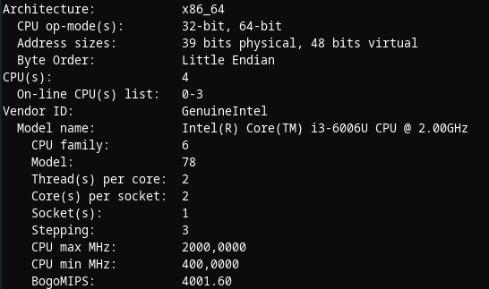
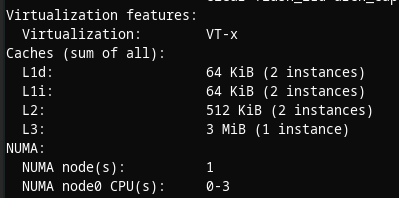

# Trabalho 3 de Comp Conc

Done: No
Status: Prioridades

## Descrição e resultados

Relatório que contém informações sobre o tempo sequencial e concorrente da execução do código realizado no laboratório 3. A aceleração é calculada dividindo-se o tempo sequencial pelo concorrente dado na seguinte fórmula: Aceleração = Tempo sequencial / Tempo concorrente.

- Para a dimensão $10^5$, temos:

| Tempo/Threads | 1 thread | 2 threads | 4 threads |
| --- | --- | --- | --- |
| Sequencial | 0.001675 | 0.001953 | 0.001905 |
| Concorrente | 0.012453 | 0.001826 | 0.001744 |
| Aceleração | 0.134506 | 1.069551 | 1.092317 |
- Para a dimensão $10^7$, temos:

| Tempo/Threads | 1 thread | 2 threads | 4 threads |
| --- | --- | --- | --- |
| Sequencial | 0.065620 | 0.084679 | 0.086666 |
| Concorrente | 0.069091 | 0.035627 | 0.029694 |
| Aceleração | 0.949762 | 2.376821 | 2.918637 |
- Para a dimensão $10^8$, temos:

| Tempo/Threads | 1 thread | 2 threads | 4 threads |
| --- | --- | --- | --- |
| Sequencial | 0.686096 | 0.676392 | 0.701140 |
| Concorrente | 0.680380 | 0.344056 | 0.301344 |
| Aceleração | 1.008401 | 1.965936 | 2.32671 |

## O PC utilizado possui as seguintes configurações:

